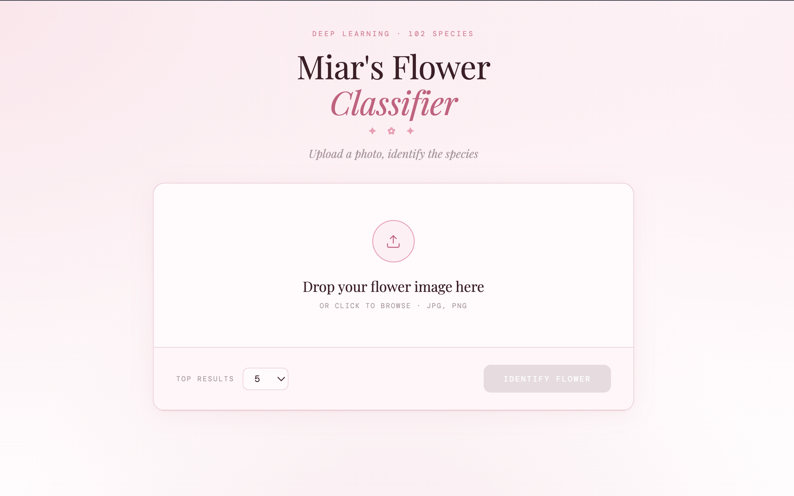

# Miar's Flower Classifier

A deep learning image classifier that identifies 102 species of flowers using TensorFlow and transfer learning with MobileNetV2 wrapped in a pretty pink web interface.



## Overview

This project trains a neural network on the [Oxford 102 Flowers dataset](https://www.robots.ox.ac.uk/~vgg/data/flowers/102/) and wraps it into a web app where you can upload any flower photo and get the top predicted species instantly.

- **Model**: MobileNetV2 (pretrained on ImageNet) + custom classifier head
- **Dataset**: Oxford 102 Flower Categories
- **Test Accuracy**: ~77%
- **Framework**: TensorFlow 2.x + Flask

## Project Structure

```
Flower-Image-Classifier/
├── app.py                  # Flask backend API
├── index.html              # Frontend web interface
├── predict.py              # Command line application
├── utils.py                # Image processing utilities
├── flower_classifier.h5    # Saved trained model
├── label_map.json          # Label to flower name mapping
├── notebook.ipynb          # Training notebook
└── test_images/
    ├── cautleya_spicata.jpg
    ├── hard-leaved_pocket_orchid.jpg
    ├── orange_dahlia.jpg
    └── wild_pansy.jpg
```

## Installation

Make sure you have Python 3.11 installed. It is recommended to use a conda environment:

```bash
conda create -n flower-classifier python=3.11
conda activate flower-classifier
pip install tensorflow tensorflow-datasets numpy matplotlib Pillow flask flask-cors
```

> **TensorFlow Compatibility Note:** The model was saved with an older version of Keras. If you encounter a `BatchNormalization` deserialization error when loading the model, you have two options:
>
> **Option 1** — Downgrade TensorFlow:
>
> ```bash
> pip install tensorflow==2.12.0
> ```
>
> **Option 2** — If you want to keep TensorFlow 2.16+, add `compile=False` when loading the model in both `app.py` and `predict.py`:
>
> ```python
> model = tf.keras.models.load_model('flower_classifier.h5', compile=False)
> ```

## Running the Web App

**Step 1 — Start the Flask backend:**

```bash
conda activate flower-classifier
python app.py
```

You should see `Running on http://127.0.0.1:7860`. Leave this terminal open.

**Step 2 — Open the frontend:**

Simply open `index.html` in your browser. Upload a flower photo, hit **Identify Flower**, and see the results!

## Command Line Usage

You can also run predictions directly from the terminal:

```bash
# Basic prediction
python predict.py ./test_images/hard-leaved_pocket_orchid.jpg flower_classifier.h5

# Return top 3 most likely classes
python predict.py ./test_images/hard-leaved_pocket_orchid.jpg flower_classifier.h5 --top_k 3
```

### Example output

```
Prediction Results:
------------------------------
1. hard-leaved pocket orchid: 99.98%
2. bearded iris: 0.01%
3. moon orchid: 0.00%
4. tiger lily: 0.00%
5. pink primrose: 0.00%
```

## Model Architecture

The model uses transfer learning — MobileNetV2 pretrained on ImageNet is used as a feature extractor, with a custom classification head trained on the flower dataset.

```
MobileNetV2 (frozen, pretrained on ImageNet)
        ↓
GlobalAveragePooling2D
        ↓
Dense(512, ReLU)
        ↓
Dropout(0.4)
        ↓
Dense(102, Softmax)
```

## Training

The model was trained for 20 epochs with the following configuration:

- **Optimizer**: Adam
- **Loss**: Sparse Categorical Crossentropy
- **Batch size**: 32
- **Image size**: 224×224
- **Data augmentation**: Random horizontal flips, random brightness

| Split      | Accuracy |
| ---------- | -------- |
| Training   | 99.8%    |
| Validation | 80.7%    |
| Test       | 77.6%    |

## Requirements

- Python 3.11
- TensorFlow 2.x (see compatibility note above)
- Flask + Flask-CORS
- NumPy
- Pillow
